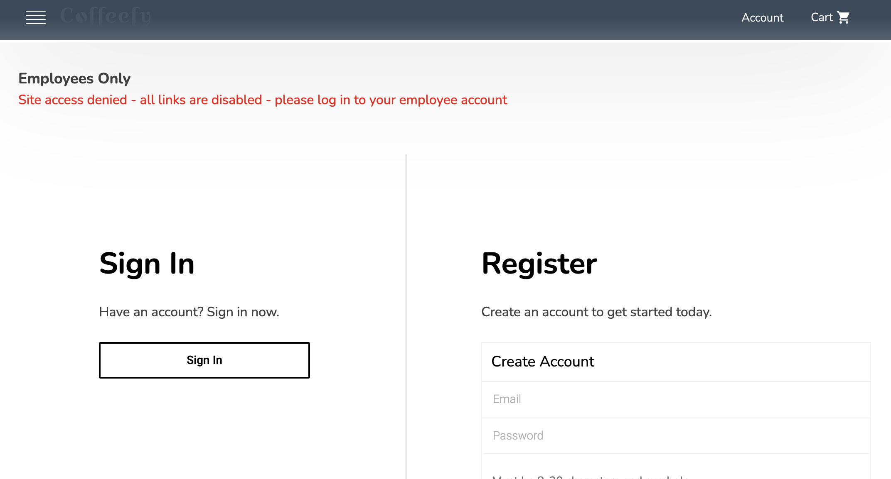
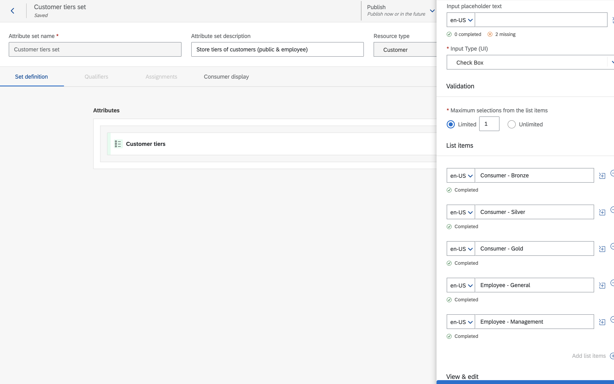

# Employee Only Store Guard

 

## What is it?
This Native Extension is designed to block access to a store based on a customer's "status" (consumer vs employee) which is saved as an Attribute Set.

Why use Native Extensions? The existing Custom Component solution is only capable of injecting iframes into an Upscale PWA. The new version of custom components, which we are calling native extensions, will be capable of injecting native angular components and services directly into an application. In addition to being visible to web-crawlers, these components will be able to interact directly with the PWA’s front end state and services, enabling the merchant to build essentially anything that an Upscale developer could.

To make it easier for a merchant to create a native extension, we have created a new public-facing upscale-web-storefront-sdk containing abstract classes which the component can access. The implementations of these classes exist as part of the PWA, and when the component is loaded, any references to them resolve to the implementations in the PWA. Those services interact with the PWA state, and are what enable much of the complex functionality that a merchant would want. The component can also access our caas-service-client-angular which provides services that interface directly with the back end services, for more fine-grained control.

## Video demo

https://test-leeann.s3.amazonaws.com/Screen+Recording+2021-08-20+at+3.20.07+PM.mov

## Setting up the Custom Component
Follow the steps below to create your own version of the Employee Store Native Extension:

1. Create a Customer Attribute Set

 

2. Configure mapping

Navigate to ./employee-only-store-guard.service.ts. And replace the Attribute codes with the codes generated in #1

3. Component mapping

Open sample-native-extension.module.ts.

Take note of the following code starting on line 10:

    ```
    this.registrationServices.register(
      "employee-only-store-component",
      EmployeeOnlyStoreGuardComponent
    )
    ```
    
This code is mapping the EmployeeOnlyStoreGuardComponent component class to the string "employee-only-store-component". The registrationService is a service which is shared between the PWA and the custom component, and essentially by providing this mapping, we are telling the PWA that this component exists

4. Publish Component Library

Open the klarna-checkout folder in terminal and execute commands to install all dependencies, build, and package the application. For the current release, neither upscale-web-storefront-sdk nor caas-service-client-angular will be available publicly. For now, they will be bundled together with the PWA app. Download a new PWA app from Workbench, and there will be a "libs" folder containing the .tgz files you'll need to install. 

Copy "libs" from the PWA to the root of custom-component-samples

The exact commands are as follows:

    npm install
    ng build sample-native-extension
    npm pack ./dist/sample-native-extension 
    
   
Host the generated tarball (.tgz) for the component library in a public environment such as NPM, GitHub, or S3. (Default tarball would be named "sample-native-extension-0.0.1.tgz")

5. Create Native Extension

Add the library as a Native Extension within the workbench, similarly to how you would a style extension.
 

6. Assign Native Extension

In order to add the library to an app where you wish to show the klarna checkout, select the extension name in the selectize field for extensions within the app configuration.
 

Note: You'll need to download the app to actually see the changes.

7. Configure Experience

Navigate to the experience editor for the experience associated with the app. Add a custom component to Account

In the custom component configuration, enter the extension ID and a component identifier "employee-only-store-component". Hit save. 

 


## Installation & Testing
If all the above setup is complete, please follow the steps below to test your new native extension.

1. Download the app.

2. Extract the contents of the zip.

3. Access the project root in terminal and run "npm install"  
  *NOTE: There is a known issue with NPM 7's handling of peer-deps. If using 7 run "npm install --legacy-peer-deps"* 

4. Add the library module to your application:

    Open the file src/app/core/extension.module.ts in your ide/text editor
    Add the following to the first list of imports:
    
   ``` 
    import { UpscaleExtensionModule } from 'sample-native-extension';

    // Add Native Extension Modules here
    const modules = [
      UpscaleExtensionModule
    ];
    ```

5. Access the application via localhost:4200. 
  - Eagerly loaded services from the Native Extension should be running. 
  - Components registered in the Native Extension, and configured to your Experience, should be visible.


## License
Copyright (c) 2021 SAP SE or an SAP affiliate company. All rights reserved. This project is licensed under the Apache Software License, version 2.0 except as noted otherwise in the [LICENSE](LICENSES/Apache-2.0.txt) file.
